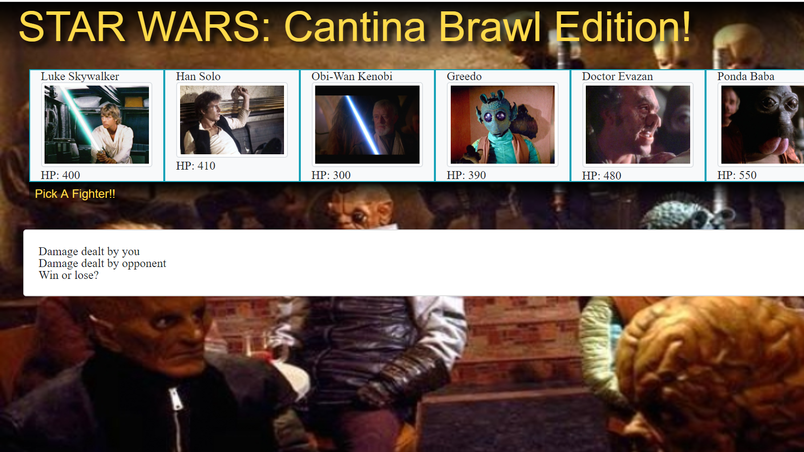

# unit-4-game
Star Wars: Cantina Brawl RPG
---------------------------------------
Star Wars episode IV: A New Hope
Setting: Cantina Bar

This is an RPG/Fighter game designed with javaScript/jQuery. The object is to pick a character and defeat all the other characters

The rules are simple: click on a character to choose them, then click on an opponent to face, then hit the "Battle!" button. Each time you click it, your character and the enemy character exchange damage but your character gets stronger with each round. Once you defeat a character (drop their HP to zero), pick another, fight again, and another, fight again, and another until you have beaten them all! 

Be careful! There's no way to restore HP so the name of the game is picking your battles wisely. If your HP goes down to 0, it's game over. Win or Lose, after the game is over, hit the "play again?" button to start all over

5/13 Notes: Sound effects may be added to the game at a later date.

### Star Wars: Cantina Brawl

